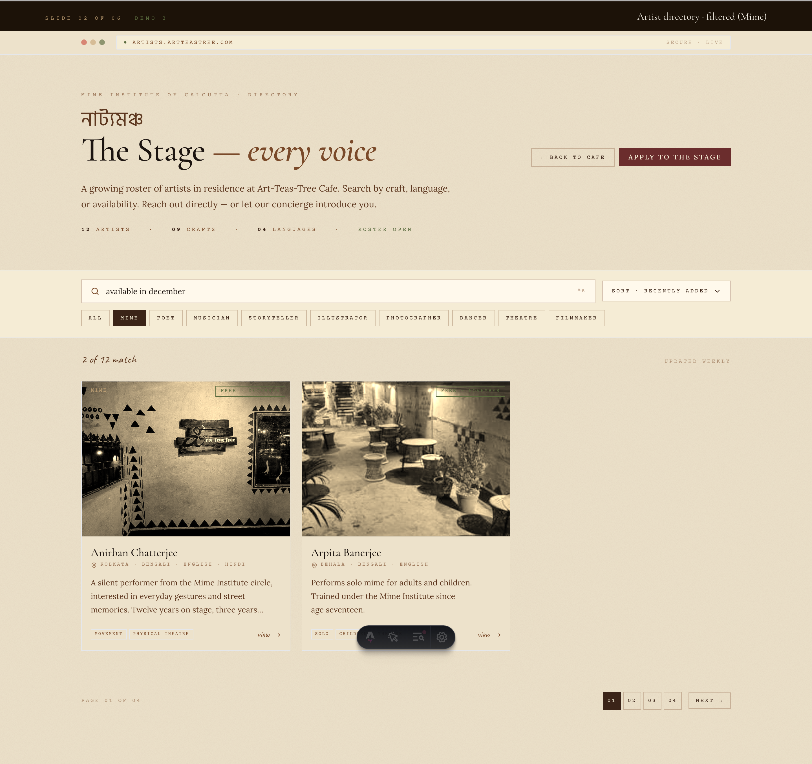
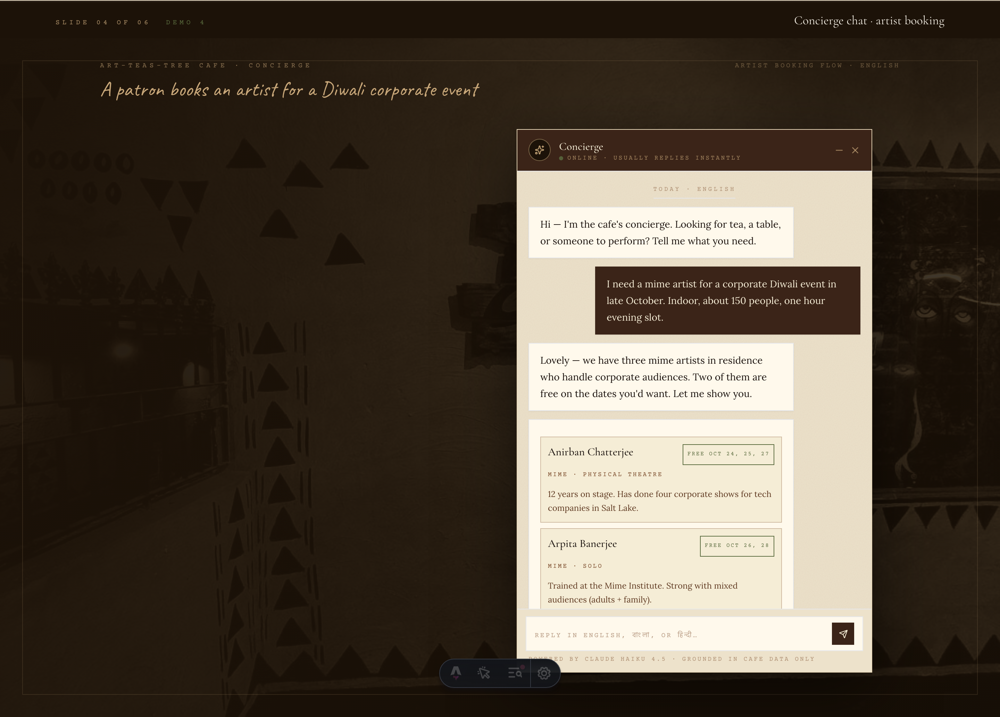
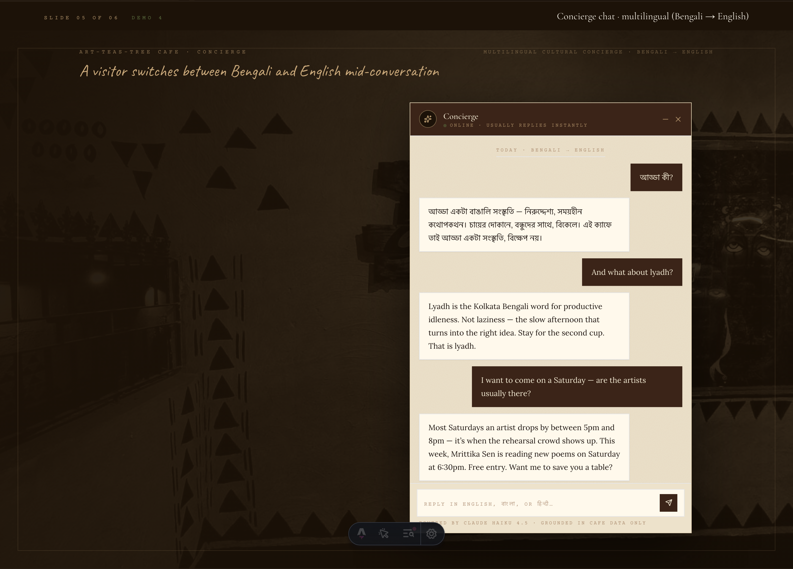
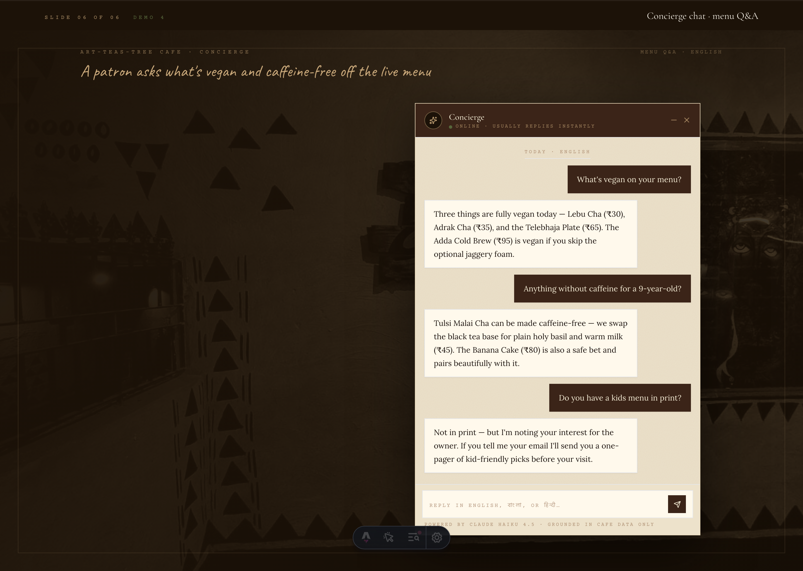

# Mockup Deck — Demo 3 & Demo 4

> Visual reference for the artist directory webapp (Demo 3) and the AI concierge chatbot (Demo 4). Pair this with [DEMOS_PUBLIC.md](DEMOS_PUBLIC.md) when walking a client through what these tiers actually look like.
>
> **Source page:** [`src/pages/mockups.astro`](../src/pages/mockups.astro) — view live at `/mockups` when the dev server is running.
> **Regenerate screenshots:** start dev server with `npm run dev`, then `node scripts/screenshot-mockups.mjs`.

---

## How to use this deck

- **For client meetings** — show the live `/mockups` page on a laptop, or share the PNGs in this folder if you only need static images.
- **For team alignment** — these are the canonical "this is what we're building" references. If a mockup doesn't match what we plan to ship, update the mockup first, not just the conversation.
- **For PDF export** — open `/mockups` in a browser, Cmd+P, "Save as PDF" (landscape). Each slide is its own viewport so the PDF breaks cleanly.
- **For raster export** — the PNGs in this folder are 2x retina (1440 × variable @ DPR 2). Drop them straight into Keynote, PowerPoint, or Figma.

---

## Slide 01 — Demo 3 · Artist directory homepage


The landing page of `artists.artteastree.com`. The Bengali title "নাট্যমঞ্চ" anchors the identity; the affiliation with the Mime Institute is stamped at the top. Below the header: a search bar, a sort control, and a row of craft chips for filtering. The grid shows all twelve artists currently in residence with their craft, availability ("free · December"), location, languages, and a two-tag preview. Pagination at the bottom confirms the directory scales beyond a single page.

**What this proves to the client:**
- The directory looks like a webapp, not a marketing page — search, filters, sort, pagination are first-class.
- The cafe's aesthetic survives the format shift. The paper texture, sepia photos, and typography all carry over.
- Twelve artists fit comfortably; the layout is built to scale to many more.

---

## Slide 02 — Demo 3 · Filtered view (Mime, available in December)



Same directory page with the "Mime" craft chip active and a search value pre-filled. The result count updates ("X of 12 match"), the chip is highlighted, and only matching artists remain in the grid.

**What this proves to the client:**
- Search and filter are not decorative — they actually narrow the roster instantly.
- The same page handles full-roster browsing and targeted searches without a separate "search results" route.

---

## Slide 03 — Demo 3 · Individual artist profile


The profile page at `artists.artteastree.com/anirban-chatterjee`. Two-column layout: portrait, identity panel (location, languages, availability, contact), and two CTAs — "Inquire about availability" (manual route) and "Let the concierge book" (Demo 4 hook) — on the left. On the right: name, tag chips, a pull-quote, the full bio, a four-thumbnail portfolio strip, a 90-day availability calendar (open / tentative / booked cells), and three related artists at the bottom.

**What this proves to the client:**
- Each artist gets a real page, not just a card — bookers can share a direct URL.
- The availability calendar is the kind of detail event organisers actually use.
- The "Let the concierge book" button is a natural place for Demo 4 to plug in.

---

## Slide 04 — Demo 4 · Concierge chat · artist booking flow



A patron asks the concierge for a mime artist for a Diwali corporate event. The bot asks the right follow-up question, surfaces two matching artists inline as cards, takes detail questions, captures the patron's email, and forwards the lead — a green "lead captured · forwarded to cafe" tag confirms the handoff.

**What this proves to the client:**
- The bot does real work — it doesn't just chat, it books.
- Booking inquiries become structured leads in the owner's inbox automatically.
- The chat window matches the cafe aesthetic; it doesn't look like a generic SaaS bot.
- The footer credit ("powered by claude haiku 4.5 · grounded in cafe data only") sets expectations honestly.

---

## Slide 05 — Demo 4 · Concierge chat · multilingual (Bengali → English)



A visitor asks "আড্ডা কী?" in Bengali. The bot replies in Bengali with a warm cultural explanation. The visitor switches to English ("And what about lyadh?") and the bot continues seamlessly in English. The conversation ends with the bot proactively suggesting a Saturday poetry reading and offering to save a table.

**What this proves to the client:**
- Trilingual support (English, Bengali, Hindi) is not bolted on — it's the default behaviour.
- The bot understands the cafe's cultural identity (adda, lyadh) and can talk about it with the right register.
- The conversation captures soft conversion opportunities (event suggestions, table holds) without being pushy.

---

## Slide 06 — Demo 4 · Concierge chat · menu Q&A



A patron asks "What's vegan on your menu?" — the bot answers with exact items and prices pulled from the live menu. Follow-up: "Anything without caffeine for a 9-year-old?" — the bot recommends Tulsi Malai Cha (with a customisation) and Banana Cake. Final question: "Do you have a kids menu in print?" — the bot honestly says no and offers to capture the patron's email for a follow-up.

**What this proves to the client:**
- The bot answers from the actual menu — there is no hallucination risk because every answer is grounded in the Google Sheet.
- It captures the gap honestly when it doesn't have an answer, and turns that into a lead.
- This use case alone justifies the bot for many cafes — staff stop answering "what's vegan?" via text forty times a week.

---

## What's not in this deck (yet)

These belong in a future revision once the corresponding pieces are scoped:

- **Owner admin dashboard** for Demo 3 (artist approval queue, edit/delete UI)
- **Owner chat-log dashboard** for Demo 4 (conversation list, sentiment flags, transcript export)
- **Artist self-submission form** for Demo 3 (the form an artist fills out to apply)
- **Closed-state chat widget** — the floating button on the cafe homepage before the chat opens

Adding any of the above is a 20–30 minute change to the mockup deck plus a re-run of the screenshot script. Ask if needed before the next client meeting.

---

## File index

```
docs/
├── MOCKUPS.md                              ← this file
└── mockups/
    ├── 01-directory-home.png               1440 × ~2400 @ 2x
    ├── 02-directory-filtered.png           1440 × ~1700 @ 2x
    ├── 03-artist-profile.png               1440 × ~2200 @ 2x
    ├── 04-chat-booking.png                 1440 × ~1200 @ 2x
    ├── 05-chat-multilingual.png            1440 × ~1100 @ 2x
    └── 06-chat-menu.png                    1440 × ~1100 @ 2x
```

Total deck size: ~30 MB. Heavy because they're retina-quality for presentation use. If the repo size becomes a concern, switch the screenshot script to `deviceScaleFactor: 1` and re-run — that drops total size to ~7 MB.

---

*Last regenerated: 2026-05-19. To regenerate after changes, run `node scripts/screenshot-mockups.mjs` with the dev server running.*
